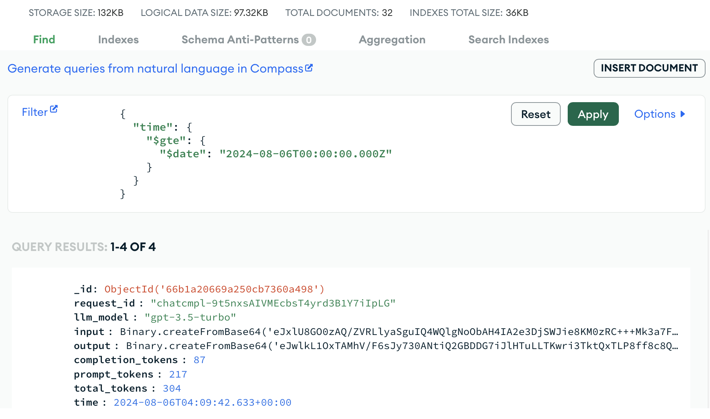

<h1>
  
  <p align="center">
	Empower RAG Request with MongoDB Monitoring
  </p>
</h1>

<p align="center">
    

<a href="./notebooks/request_example.ipynb">
        
    </a>
</p>

## Table of Contents

- [Update](#update)
- [Quickstart](#quickstart)
- [Contributing](#contributing)

## Update
- [TBD]: Support more LLM APIs providers.
- [08/2024]: Track OpenAI API usage for both text [`ChatOpenAI`](/simple_rag/chat/chat_openai.py) and vision [`ChatOpenAIVision`](/simple_rag/chat/chat_openai.py) requests.

## Quickstart

To re-product the project, please refer to the repository

```
├── LICENSE            <- Open-source license if one is chosen
├── Makefile           <- Makefile with convenience commands like `make data` or `make train`
├── README.md          <- The top-level README for developers using this project.
├── notebooks          <- Jupyter notebooks. Naming convention is a number (for ordering),
│                         the creator's initials, and a short `-` delimited description, e.g.
│                         `1.0-jqp-initial-data-exploration`.
│
├── pyproject.toml     <- Project configuration file with package metadata for simple_rag
├── requirements.txt   <- The requirements file for reproducing the analysis environment, e.g.
│                         generated with `pip freeze > requirements.txt`
│
├── setup.cfg          <- Configuration file for flake8
│
└── simple_rag                <- Source code for use in this project.
    │
    ├── __init__.py    <- Makes simple_rag a Python module
```

The structure of source code:


Let’s install the library

```bash
pip install -r requirements.txt
```

Create the `.env` file containing `OPENAI_API_KEY` the connection to the `MongoDB` Atlas

```
## OPENAI
OPENAI_API_KEY=sk-***

## MONGODB
COLLECTION_NAME=<your-collection-name>
DB_NAME=<your-database-name>
CLUSTER_ADDRESS=<your-cluster-ip-address>
USRNAME=<provided-user-name>
PASSWD=<provided-password>
```

An example for logging a certain LLM request:

```python
from simple_rag.chat.chat_openai import ChatOpenAI
from simple_rag.utils import connect_to_database, insert_to_db

collection = connect_to_database()

llm = ChatOpenAI()

system_prompt = """
    You possess in-depth knowledge of natural images and can describe them with ease. \
    From the given input text indicating the category name of a certain object, your task involves the following steps:
    1-Imagine a scene containing the input object.
    2-Generate 4 descriptions about different key appearance features of the input object from the imagined scene, with each description having a maximum of 16 words.
    3-Output a JSON object containing the following key:
        "description": <list of 4 descriptions>

    Use the following examples:
        Input text: "sea lion"
        Answer: "description": ["A round-bellied seal sits on a rock, looking intently at something off-camera.", "The seal lies with flippers tucked, sleek body well-maintained.", "The seal's thick, smooth fur and large dark eyes show alertness and curiosity.", "Turquoise water contrasts with the seal's brown fur and grey rock, highlighting its natural environment."]
"""
response = llm.request(system_prompt=system_prompt, user_prompt="British shorthair")
insert_to_db(collection=collection, data=response)
print(response)
```

the output follows:

```bash
🔥 Successfully Log Request to Database
{'request_id': 'chatcmpl-9sPkkwmcz7pIsU3hLH3Zz9vYRT70O', 'output': {'description': ['A fluffy British Shorthair cat lounges lazily on a plush velvet armchair.', 'Its round face and large, expressive eyes give off an air of gentle curiosity.', "The cat's dense, plush coat in shades of blue-grey exudes a luxurious appearance.", "Sunlight filters through a nearby window, casting a warm glow on the cat's fur."]}, 'completion_tokens': 80, 'prompt_tokens': 217, 'total_tokens': 297}
```

Dashboard of MongoDB should be looked like



## Contributing

All contributions are welcome.


